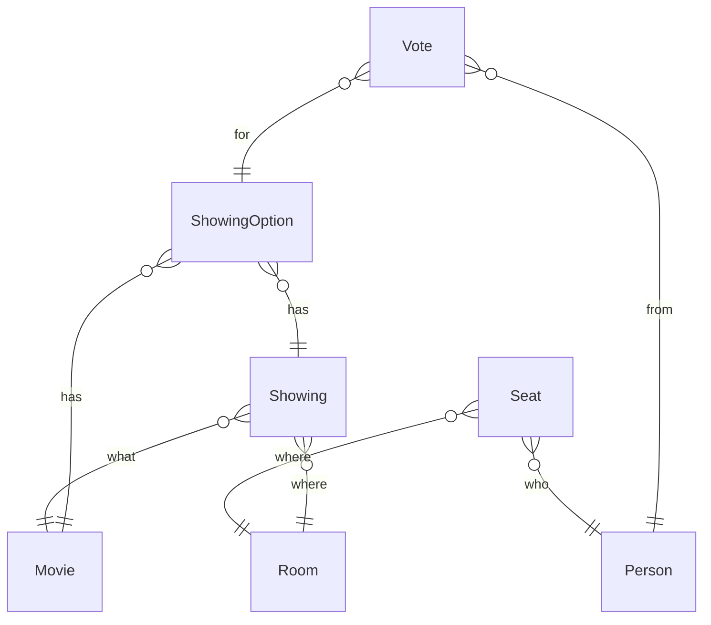

<!--
This file is part of no_one_loses_on_movie_night.

no_one_loses_on_movie_night is free software: you can redistribute it and/or modify it under the terms of the GNU General Public License as published by the Free Software Foundation, either version 3 of the License, or (at your option) any later version.

no_one_loses_on_movie_night is distributed in the hope that it will be useful, but WITHOUT ANY WARRANTY; without even the implied warranty of MERCHANTABILITY or FITNESS FOR A PARTICULAR PURPOSE. See the GNU General Public License for more details.

You should have received a copy of the GNU General Public License along with Foobar. If not, see <https://www.gnu.org/licenses/>.
-->

# Data model

These are [mermaid](https://mermaid.js.org/) entity relationship diagrams for the models in `nolomn`.

## High level

